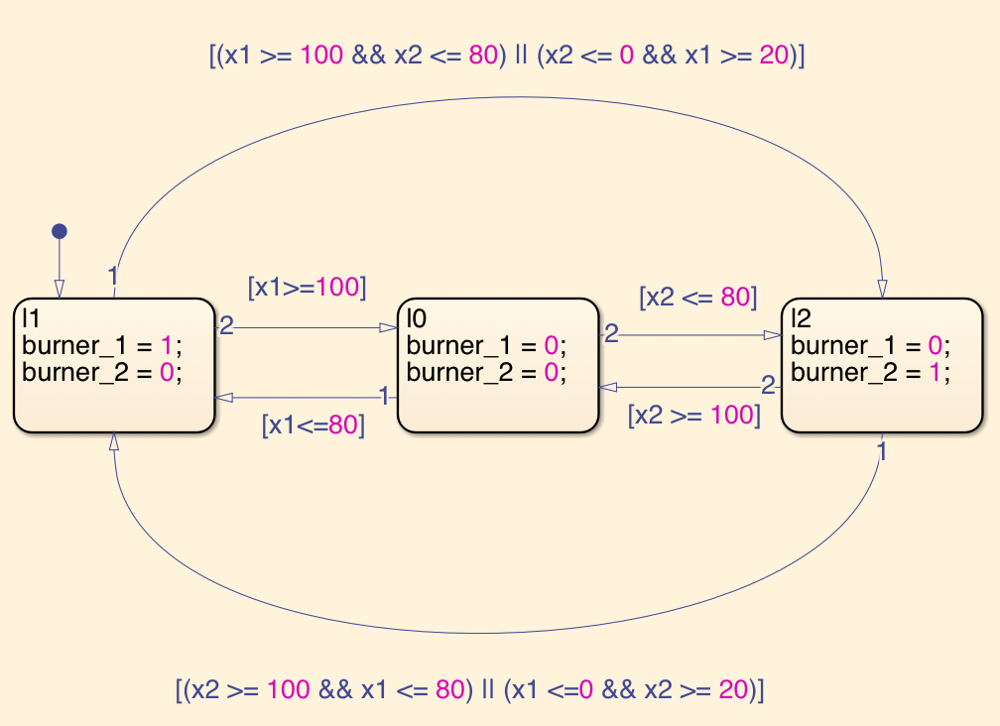

Shared Gas Burner Model
=======================

This repository contains the Simulink model of the simple shared gas-burner model in [Doyen+, FORMATS'05]. We modified the guard of the transitions because Simulink does not allow nondeterministic branching. We also made the initial values configurable. We used this model in the experiments of our paper [Waga+, ICCPS'21]. 

Files
-----

- `shared_gas_burner.slx`: The Simulink model of the shared gas-burner model.
- `run_shared_gas_burner.m`: The MATLAB function to run the shared gas-burner model with the given initial values.
- `run.m`: A MATLAB script to execute the shared gas-burner model with the default initial values and generate the resulting tsv file.

Usage
-----

Run `run.m` in MATLAB to generate the resulting TSV file of the simulation.

You can also call `run_shared_gas_burner` from MATLAB.

Model
------

This Simulink model encodes the following hybrid automaton. 

The ODEs for each burner's stateus is as follows, where h = 2, a = 0.01, b = 0.005.

- burner_1 = 1: 
- burner_2 = 1: 
- burner_1 = 0: 
- burner_2 = 0: 

Reference
---------

- [Doyen+, FORMATS'05]: Doyen, Laurent, Thomas A. Henzinger, and Jean-François Raskin. "Automatic rectangular refinement of affine hybrid systems." International Conference on Formal Modeling and Analysis of Timed Systems. Springer, Berlin, Heidelberg, 2005.
- [Waga+, ICCPS'21]: Waga, Masaki, Étienne André, and Ichiro Hasuo. "Model-bounded monitoring of hybrid systems." Proceedings of the ACM/IEEE 12th International Conference on Cyber-Physical Systems. 2021.
